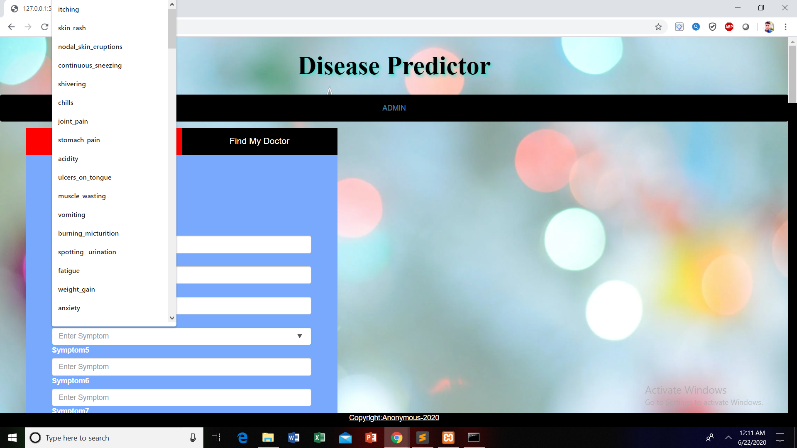
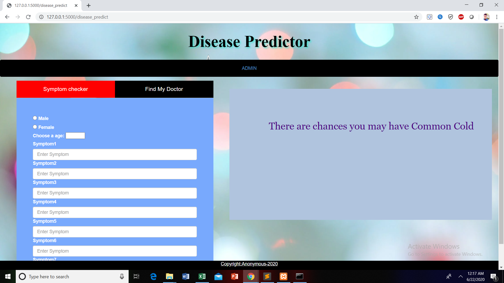
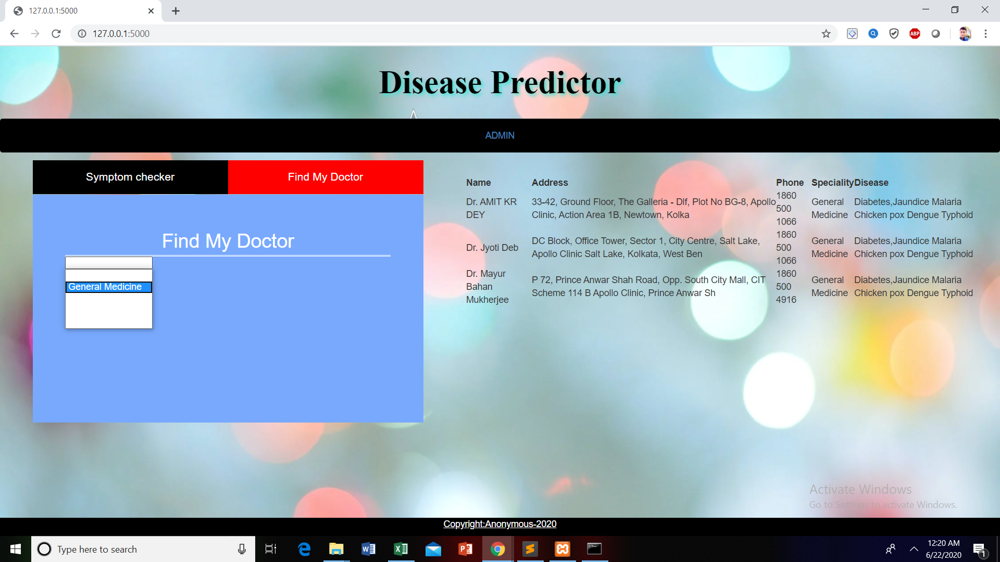

## Disease-Prediction-system-using-Machine-Learning-and-Flask 
### Code Requirements
Python Version > 3.5

### Description
This is a disease prediction system based on symptoms build using Machine learning and Flask.It helps us to predict a disease by using symptoms of the diseased person and will find you an appropriate docter for curing you.

Admin Login.


Home Page.


Fill the symptoms.



Predicts the disease.




Find doctors available near you.



```
