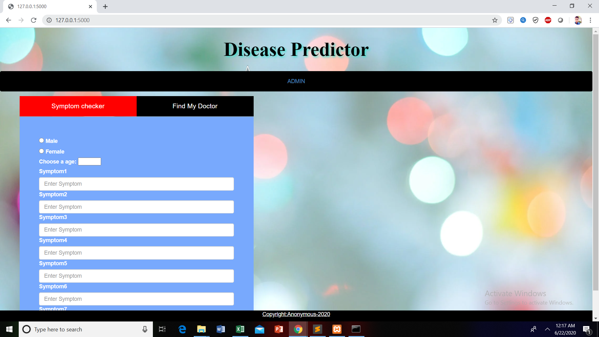

## Disease-Prediction-system-using-Machine-Learning-and-Flask 
### Code Requirements
Python Version > 3.5

### Description
This is a disease prediction system based on symptoms build using Machine learning and Flask.It helps us to predict a disease by using symptoms of the diseased person and will find you an appropriate docter for curing you.

<h3>Admin Login.</h3>


<h3>Home Page.</h3>



<h3>Fill the symptoms.</h3>


<h3>Predicts the disease.</h3>


<h3>Find doctors available near you.</h3>


```
